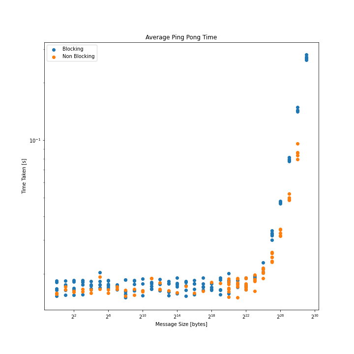
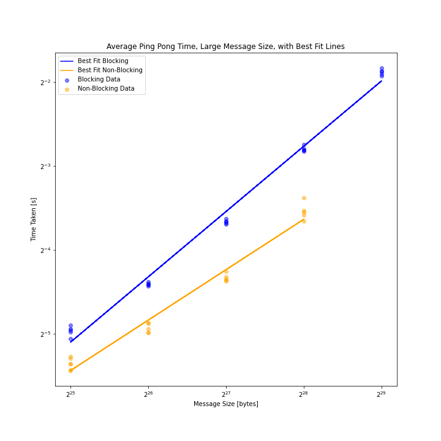
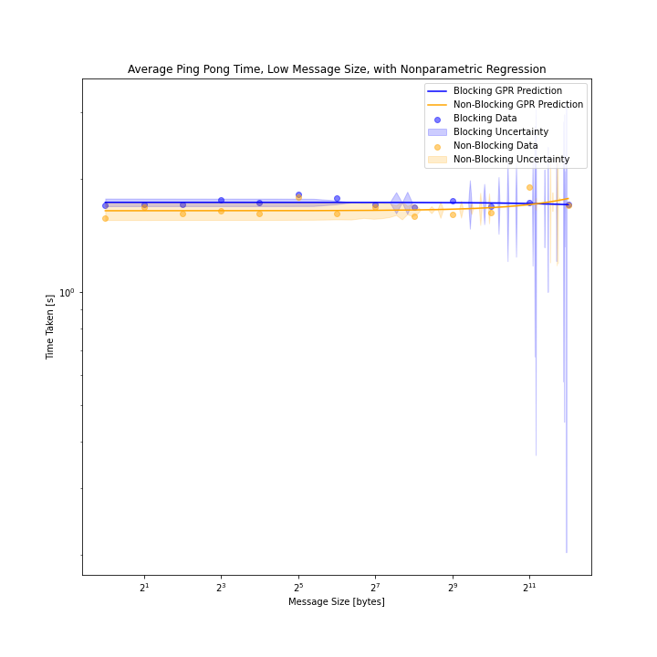
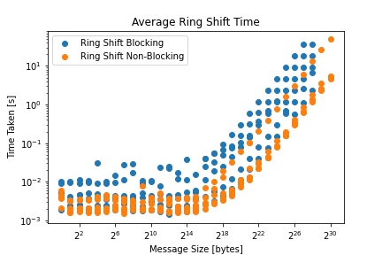
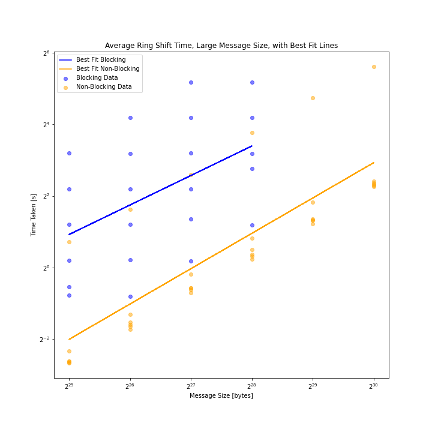
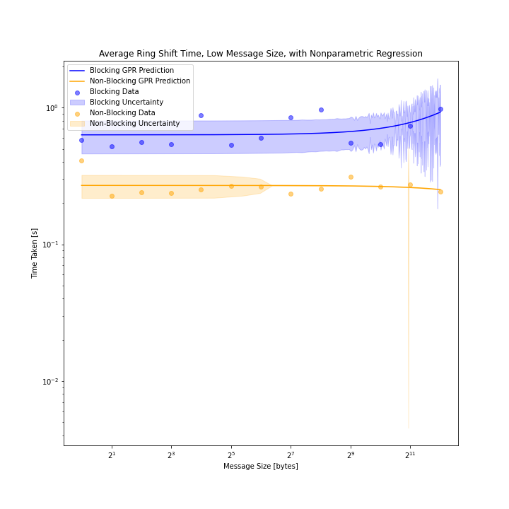

# Project 3: MPI Ping-Pong and Ring Shift

## Background

The ping-pong problem is a benchmark often used to evaluate the performance of message passing interfaces (MPI) in parallel computing. In this problem, two processes exchange messages back and forth a specified number of times, with each process sending a message and receiving a message alternately. In the ping-pong, process `i` sends a message of size `m` to process `j`, then receives a message of size `m` back from `j`. The values of `i`, `j`, and `m` to use are given below.

The "ring shift" problem is similar to ping-pong. In the MPI ring shift, a group of processes is arranged in a ring, with each process holding a unique subset of a larger array of data. The goal is to shift the data elements by a specified number of positions around the ring, wrapping around the ends of the ring as necessary. 

## Part 1: Blocking Ping-Pong

Your task is to implement the ping-pong problem using MPI in C or C++ and analyze the behavior and performance of your code. Specifically, you should:

Implemented in `ping_pong_blocking.cpp` & `ping_pong_nonblocking.cpp`

1. Implement the ping-pong problem using MPI in C or C++. Use blocking `MPI_Send()` and `MPI_Recv()` calls. You should define the number of iterations and the size of the message to be exchanged.
2. Measure the time taken to complete the ping-pong exchange for different message sizes. You should use the `MPI_Wtime()` function to obtain the time before and after the exchange and calculate the elapsed time. Vary the message size from 2 bytes to 4 kilobytes in powers of 2 (i.e., 2 bytes, 4 bytes, 8 bytes,..., 2048 bytes, 4096 bytes). For each message size, perform 100 iterations of the ping-pong to build up statistical significance.
3. Record the total amount of data sent and received during the ping-pong exchange for each configuration.
4. Repeat steps 2 and 3 but ensure that the 2 processes that are communicating reside on different physical hardware nodes on HPCC.
5. Plot the average communication time of a single exchange (send and receive) as a function of message size for the two cases. Using this plot, estimate the _latency_ and _bandwidth_ for each case. Are they different? Explain your results.
6. Analyze and discuss your results. Explain the behavior of the resulting curves.
 - The time per exchange is approximately constant versus message size until about 2^24 bytes. The "plateau" region, where the time per exchange is constant, represents the latency of the communication. This portion of the graph is dominated by the overhead associated with the MPI communication. Beyond 2^24 bytes, the time per exchange increases with message size. For larger message sizes (>2^24 bytes), the communication is bandwidth limited, rather than limited by the latency and initial overhead of the MPI communication. Since the bandwidth represents the maximum rate at which data can be exchanged, we see an increase in the communication time with increasing message size for large message sizes. 

We can see the general plot of our data showing this behavior below.

We can take regression models of the upper and lower ranges of the model to approximate the latency and bandwidth of the network.

This log-log plot allows us to estimate the bandwidth or slope of the the best fit line. From the model, we obtain:

Slope Blocking =  0.7771507429724145

Slope Nonblocking =  0.5997510375078775

We can find the Bandwidth by taking $bandwidth = \frac{1}{2^{slope}}$. Then we have

Approximate Bandwidth for Ping Pong Blocking:  0.5835180776317543 byte/sec

Approximate Bandwidth for Ping Pong Nonblocking:  0.6598678173999306 byte/sec

While for latency, we check the intercept of the regression as we approach a message size of 0 bytes. This is found to be:

Latency Prediction Blocking =  1.729923057936972 sec

Latency Prediction Nonblocking =  1.6430407723897495 sec

## Part 2: Non-block Ping-Pong

Repeat Part 1 using non-blocking MPI communication, i.e., using `MPI_Isend()` and `MPI_Irecv()`. You will need to include explicit process synchronization using, e.g., `MPI_Wait()` calls. Compare the results to the blocking case.

Both Blocking and Nonblocking above. Nonblocking took slightly less time on average, with a lower latency and steadily higher bandwidth.

## Part 3: MPI Ring Shift

Implemented in `ring_shift_blocking.cpp` & `ring_shift_nonblocking.cpp`

1. Implement the MPI ring shift in C or C++ for an arbitrary number of processes in the ring and arbitrary message size (i.e., number of elements per process). In your implementation, use `MPI_Sendrecv()` instead of separate `MPI_Send()` and `MPI_Recv()` calls.
2. As in Parts 1 and 2, vary the message size from 2 bytes to 4 kb, in powers of 2. Also vary the number of processes used from 2 to `N`, in powers of 2, where `N` is sufficiently large that rank 0 and rank `N-1` are guaranteed to reside on separate nodes (`N` will depend on which cluster you are using on HPCC).
3. Compute the bandwidth and latency, as above. Plot the bandwidth as a function of message size. Include separate lines for each number of processes used. 
4. Analyze and discuss your results. Explain the behavior of the resulting curves.
 - The results of both non-blocking and blocking communication for the ping-ping exchange are shown in the same plot. Within the latency/overhead limited region, the time per exchange is approximately the same for both blocking and non-blocking communication. Within the bandwidth-limited region (>2^24 bytes), the non-blocking communication is faster than the blocking communication. Non-blocking communication allows for the overlap of communication and computation, meaning each task can proceed regardless of the communication status of its outgoing/incoming message. Blocking communication requires the synchronization of send and receive calls, meaning computation cannot overlap with communication. Therefore, non-blocking communication is expected to be faster than blocking communication. 

######################
We can see the general plot of our data showing this behavior below.

We can take regression models of the upper and lower ranges of the model to approximate the latency and bandwidth of the network.

This log-log plot allows us to estimate the bandwidth or slope of the the best fit line. From the model, we obtain:

Slope Blocking =  0.8236670935494553

Slope Nonblocking =  0.9867006748686004

We can find the Bandwidth by taking $bandwidth = \frac{1}{2^{slope}}$. Then we have

Approximate Bandwidth for Ping Pong Blocking:  0.5650039686993044 byte/sec

Approximate Bandwidth for Ping Pong Nonblocking:  0.5046305049676336 byte/sec

While for latency, we check the intercept of the regression as we approach a message size of 0 bytes. This is found to be:

Latency Prediction Blocking = 0.6328572964072512 sec

Latency Prediction Nonblocking =  0.2698238677307304 sec

## Part 4: Non-blocking MPI Ring Shift

Repeat Part 3 but using non-blocking communication via `MPI_Isendrecv()`. Compare the results to the blocking case.

Plots and data above. The resulting graphs show the nonblocking had lower latency and lower bandwidth.

## What to turn-in

To your git project repo, commit your final working code for the above exercises and a concise write-up including all plots, and detailed responses to the questions posed concerning your results. 
